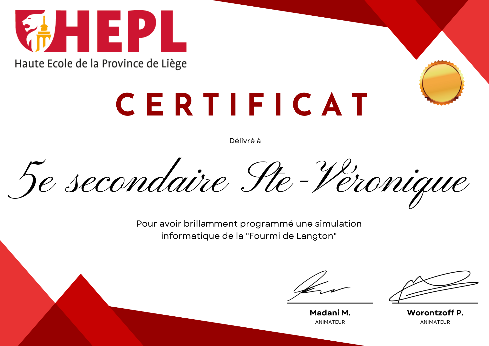

# La fourmi de Langton - Le code complet (en utilisant les fonctions des Papers animés)

@[fourmi]({"stubs": ["main.c"],"command": "sh /project/target/run.sh", "project" : "fourmi"})

## Votre diplome !

 

Vous l'avez bien mérité !! 

 

<!--

    

## Immersion en informatique

Et pour Info : **Journée d'immersion en informatique à la HEPL** :
- **Quand ?** Le **vendredi 18 avril de 8h30 à 15h30** ;
- **Où ?** Sur le site du parc des Marêts à Seraing (**Rue Peetermans 80 - 4100 Seraing**) ;
- **Comment ?** En envoyant un mail pour s'inscrire à **tech.secretariat.seraing@hepl.be** (attestation de participation de la HEPL à l'issue de la journée).

-->
