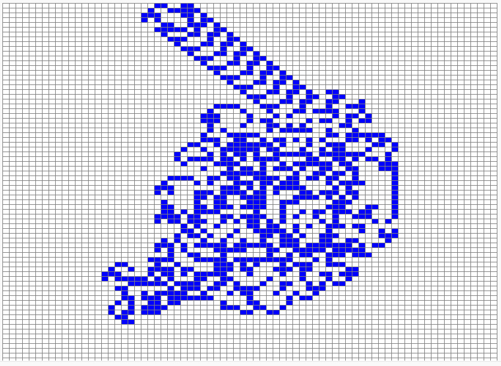

# La fourmi de Langton - étape 10, dézoom et autoroute (11000 mouvements)

## Les explications

Nous allons maintenant pouvoir observer la fourmi qui construit son autoroute.

Pour cela nous allons faire exactement comme à l'étape précédente mais avec d'autres valeurs.

## Les consignes de notre mission

Nous avions une fourmi de Langton qui a effectué correctement :
- *2000* mouvements ;
- Dans un Paper de *35x35* ;
- Avec des cases de *15* pixels de côtés ;
- Avec un délai de pause entre chaque étape de l'animation *de 3 millièmes de seconde* ;
- Et un curseur (notre fourmi) initialement positionné en *18e ligne, 18e colonne*.

Nous devons maintenant obtenir une fourmi de Langton qui va effectuer correctement :
- ***11000*** mouvements ;
- Dans un Paper de ***75x75*** ;
- Avec des cases de ***8*** pixels de côtés ;
- Avec un délai de pause entre chaque étape de l'animation ***d' un demi millième de seconde*** ;
- Et un curseur (notre fourmi) initialement positionné en ***38e ligne, 38e colonne***.
 

## Alerte au piège !

**Un demi millième de secondes, écrit en seconde... c'est ? c'est ?**

 

## Le programme C (à vous les commandes !)

**! N'hésitez pas à revenir en arrière et copier-coller ci-dessous votre programme précédent avant de le modifier.**

@[fourmi1]({"stubs": ["main.c"],"command": "sh /project/target/run.sh", "project" : "fourmi1"})

Si tout est bon, on constate que la fourmi trace son chemin en respectant le petit dessin montré dans la vidéo d'introduction :

Et voilà ! L'autoroute est construite ! Merci à tous pour votre attention et votre participation :-)

Pour les curieuses et les curieurs, la page suivante donne l'entièreté du petit programme de la fourmi de Langton (en utilisant les fonctions des Papers animés).
