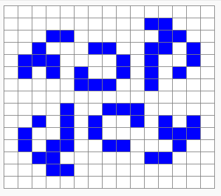

# La fourmi de Langton - étape 8, dézoom et comportement symétrique (472 mouvement)

## Les explications

Pour voir le comportement symétrique de notre fourmi, nous allons :
1) Agrandir le Paper animé dans lequel elle se balade ;
1) Diminuer la taille des cases pour ne pas avoir un Paper trop grand (d'où l'effet de "dézoom") ;
1) Accélérer la vitesse de l'animation ;
 
Tout cela pourra se faire en modifiant les valeurs de paramètres de l'instruction `init_paper();`

Pour rappel :

```C
init_paper(nb_lignes, nb_colonnes, taille, delai_anim, ctrl_les_pas); 
```
est une instruction qui permet de créer et paramétrer un Paper animé.

- `nb_lignes` est un premier *paramètre*, c'est un nombre entier qui donne le nombre de lignes du Paper
- `nb_colonnes` est un deuxième paramètre (nombre entier) qui donne le nombre de colonnes du Paper
- `taille` donne la dimension en pixels d'une case du Paper (p. ex. 25 pour un Paper dont chaque case mesure 25 pixels de côtés)
-  `delai_anim` est le temps de pause (en secondes) entre chaque coloriages ou effacements de cases. Ceci permet de contrôler la vitesse de l'animation. Ce délai peut-être un nombre décimal, par exemple 0.05 pour 5 centièmes de seconde.
-  Nous ne nous préoccuperons pas du paramètre `ctrl_les_pas`, il devra être mis à 0.

<br /><br />

Mais en modifiant la taille du Paper, notre fourmi, pour rester au départ au milieu de celui-ci, doit se déplacer au bon endroit dans le Paper (juste après sa création).

Nous devrons donc adapter les valeurs de paramètres de l'instructions `move_to();`

Pour rappel :

```C
move_to(ligne, colonne); 
```
est une instruction qui permet de déplacer le curseur dans le Paper.

- `ligne` est un premier paramètre, c'est un nombre entier qui donne le numéro de la ligne du Paper à atteindre
- `colonne` est un deuxième paramètre (nombre entier) qui donne le numéro de la colonne à atteindre. 

<br /><br />

Nous allons également bien entendu augmenter le nombre de mouvements de la fourmi, cela se fera très simplement en modifiant la valeur de `n` dans notre boucle.

Pour rappel :

```C
repeat (n) {
   instructions_exécutées_n_fois
} loop;
```

Cette écriture permet de faire répéter plusieurs fois l'exécution d'un certain nombre d'instructions.

- `n` est le nombre de répétitions
- `instructions_exécutées_n_fois` est une série d'instructions qui seront répétées exactement n fois.

<br />

## Les consignes de notre mission

Nous avions une fourmi de Langton qui a effectué correctement :
- *8* mouvements ;
- Dans un petit Paper de *7x7* ;
- Avec des cases de *25* pixels de côtés ;
- Avec un délai de pause entre chaque étape de l'animation *d'une demi seconde* ;
- Et un curseur (notre fourmi) initialement positionné en *4e ligne, 4e colonne*.

Nous devons maintenant obtenir une fourmi de Langton qui va effectuer correctement :
- ***472*** mouvements ;
- Dans un Paper de ***15x15*** ;
- Avec des cases de ***20*** pixels de côtés ;
- Avec un délai de pause entre chaque étape de l'animation ***de 25 millièmes de seconde*** ;
- Et un curseur (notre fourmi) initialement positionné en ***8e ligne, 8e colonne***.
<br />

## Alerte au piège !

**Veiller à écrire correctement *25 millièmes de secondes* en un nombre (réel) de secondes.**

**Rappelons-nous qu'on commence à numéroter les lignes et les colonnes en partant de 0. (P. ex. le numéro de la première ligne est le 0 et le numéro de la quatrième colonne est le 3).**

<br />

## Le programme C (à vous les commandes !)

@[fourmi8]({"stubs": ["main.c"],"command": "sh /project/target/run.sh", "project" : "fourmi8"})

Si tout est bon, on constate que la fourmi trace son chemin en respectant le petit dessin montré dans la vidéo d'introduction :



Nous avons réussi à observer le comportement symétrique de la fourmi. Allons donc vérifier son comportement cahotique (cette "transition" que personne ne comprend vraiment !)
