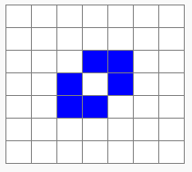

# La fourmi de Langton - étape 8, dézoom et comportement symétrique (472 étapes) !

## Les explications

Pour voir le comportement symétrique de notre fourmi, nous allons :
1) Agrandir le Paper animé dans lequel elle se balade ;
1) Diminuer la taille des cases pour ne pas avoir un Paper trop grand (d'où l'effet de "dézoom") ;
1) Accélérer la vitesse de l'animation ;
 
 Tout cela pourra se faire en modifiant les valeurs de paramètres de l'instruction `init_paper();`

Pour rappel :

```C
init_paper(nb_lignes, nb_colonnes, taille, delai_anim, ctrl_les_pas); 
```
est une instruction qui permet de créer et paramétrer un Paper animé.

- `nb_lignes` est un premier *paramètre*, c'est un nombre entier qui donne le nombre de lignes du Paper
- `nb_colonnes` est un deuxième paramètre (nombre entier) qui donne le nombre de colonnes du Paper
- `taille` donne la dimension en pixels d'une case du Paper (p. ex. 25 pour un Paper dont chaque case mesure 25 pixels de côtés)
-  `delai_anim` est le temps de pause (en secondes) entre chaque coloriages ou effacements de cases. Ceci permet de contrôler la vitesse de l'animation. Ce délai peut-être un nombre décimal, par exemple 0.05 pour 5 centièmes de seconde.
-  Nous ne nous préoccuperons pas du paramètre `ctrl_les_pas`, il devra être mis à 0.

Mais en modifiant la taille du Paper, notre fourmi, pour rester au départ au milieu de celui-ci, doit se déplacer au bon endroit dans le Paper (juste après sa création).

Nous devrons donc adapter les valeurs de paramètres de l'instructions `move_to();`

Pour rappel :


Nous allons également bien entendu augmenter le nombre de répétitions, cela se fera très simplement en modifiant la valeur de 'n' dans notre boucle.

Pour rappel :

```C
repeat (n) {
   instructions_exécutées_n_fois
} loop;
```

Cette écriture permet de faire répéter plusieurs fois l'exécution d'un certain nombre d'instructions.

- `n` est le nombre de répétitions
- `instructions_exécutées_n_fois` est une série d'instructions qui seront répétées exactement n fois.

<br />

## Les consignes de notre mission

**Nous avions une fourmi de Langton qui a effectué correctement 8 étapes dans un petit Paper de 7x7  programme qui nous permettait d'effacer ou colorier une même case plusieurs fois.**

**Nous devons maintenant préciser que :<br />
Si la case est coloriée, on l'efface, puis on tourne la fourmi d'un quart de tour vers sa gauche et on la fait avancer dune case  !<br />
Sinon (donc si la case n'est pas coloriée), on la colorie, puis on tourne la fourmi d'un quart de tour vers sa droite et on la fait avancer d'une case  !**

<br />

## Alerte au piège !

**Bien respecter l'ordre des opérations :**<br />
**1) Créer le Paper animé ;**<br />
**2) Se déplacer sur la case du milieu ;**<br />
**3) REPETER 8 FOIS : SI la case est coloriée, on l'efface et la fourmi par à sa gauche SINON, on la colorie et le fourmi part à sa droite ;**<br />
**4) Afficher le Paper animé.**

<br />

## Le programme C (à vous les commandes !)

**! N'hésitez pas à revenir en arrière et copier-coller ci-dessous votre programme précédent avant de le modifier.**

@[fourmi1]({"stubs": ["main.c"],"command": "sh /project/target/run.sh", "project" : "fourmi1"})

Si tout est bon, on constate que la fourmi trace son chemin en respectant le petit dessin montré dans la vidéo d'introduction :



La logique à suivre par la fourmi est maintenant programmée, ne nous reste plus qu'à tester avec une plus grande surface de Paper animé (en quelque sorte "dézoomer") et en augmentant le nombre d'étapes.
