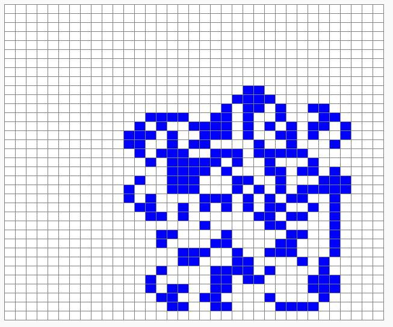

# La fourmi de Langton - étape 9, dézoom et comportement cahotique (2000 mouvements)

## Les explications

Nous allons maintenant pouvoir observer la fourmi qui détruit son beau dessin et adopte un chemin plutôt cahotique et désordonné.

Pour cela nous allons faire exactement comme à l'étape précédente mais avec d'autres valeurs.

## Les consignes de notre mission

Nous avions une fourmi de Langton qui a effectué correctement :
- *472* mouvements ;
- Dans un Paper de *15x15* ;
- Avec des cases de *20* pixels de côtés ;
- Avec un délai de pause entre chaque étape de l'animation *de 25 millièmes de seconde* ;
- Et un curseur (notre fourmi) initialement positionné en *8e ligne, 8e colonne*.

Nous devons maintenant obtenir une fourmi de Langton qui va effectuer correctement :
- ***2000*** mouvements ;
- Dans un Paper de ***35x35*** ;
- Avec des cases de ***15*** pixels de côtés ;
- Avec un délai de pause entre chaque étape de l'animation ***de 3 millièmes de seconde*** ;
- Et un curseur (notre fourmi) initialement positionné en ***18e ligne, 18e colonne***.
 

## Alerte au piège !

**Pas de piège en vue, capitaine !**

 

## Le programme C (à vous les commandes !)

@[fourmi9]({"stubs": ["main.c"],"command": "sh /project/target/run.sh", "project" : "fourmi9"})

Si tout est bon, on constate que la fourmi trace son chemin en respectant le petit dessin montré dans la vidéo d'introduction :

Nous avons réussi à mettre en évidence le comportement désordonné de la fourmi. Allons donc vérifier qu'elle finit bien par construire son autoroute !

